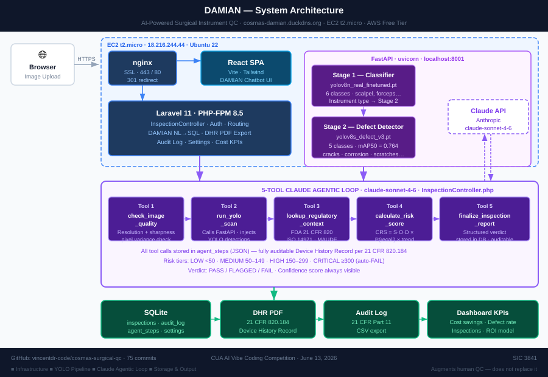

# DAMIAN — AI-Powered Defect Detection for Surgical Instrument Manufacturing

[](https://github.com/vincentdr-code/cosmas-surgical-qc/actions/workflows/ci.yml)

**Live application:** https://cosmas-damian.duckdns.org  
**Marketing site:** https://cosmas-website.vercel.app  
**GitHub:** https://github.com/vincentdr-code/cosmas-surgical-qc  
**Stack:** Laravel 11 · PHP 8.5 · YOLOv8n + YOLOv8s (two-stage pipeline) · Claude API (claude-sonnet-4-6) · SQLite · React (Vite) · nginx · AWS EC2 (t2.micro, Free Tier)

---

## What This Is

DAMIAN is a production-deployed AI quality-control system built by Cosmas for surgical instrument manufacturing (SIC 3841). A QC inspector uploads a photo of a surgical instrument; the system runs it through a five-step autonomous AI agent pipeline and returns a PASS / FAIL / FLAGGED verdict with a confidence score, Composite Risk Score, regulatory citation, and cost-based decision recommendation — all in under 60 seconds.

The core question: **How can AI-powered defect detection reduce QC costs while improving patient safety and maintaining FDA compliance?**

The answer the system demonstrates: $0.14 saved per inspection unit vs. manual review, $16,800/yr at 10,000 units/month, with every result logged to an auditable Device History Record.

---

## Architecture Overview



```
Browser / React SPA (Vite)
        │
        ▼
   nginx (HTTPS, port 443)
   ├── /upload, /dashboard, /home, /audit-log, /results/*  → PHP-FPM (Laravel)
   ├── /css/*                                              → Laravel public/
   └── /*                                                  → React dist/ (SPA catch-all)
        │
        ▼
   Laravel 11 Application
   ├── InspectionController       — thin HTTP layer, delegates to orchestrator
   ├── InspectionOrchestratorService  — Claude agent loop (up to 12 iterations)
   ├── DashboardController        — KPI aggregation, 14-day trend data
   └── RoiController              — ROI calculator
        │
        ├── Claude API (claude-sonnet-4-6)
        │   tool_use loop: up to 12 iterations, 5 tools, 4096 max_tokens
        │
        └── YOLOv8s Service (FastAPI, port 8001, localhost only)
                /health  /detect  /reload-model
```

**Infrastructure:** AWS EC2 t2.micro (Free Tier) · Ubuntu 22.04 · SQLite 3 · PHP-FPM 8.5 · systemd service for YOLO

---

## The AI Agent Pipeline

Every image upload triggers a Claude tool-use agentic loop. Claude decides which tool to call next based on accumulated context — it is not scripted; it reasons.

| Step | Tool | What It Does |
|------|------|--------------|
| 1 | `check_image_quality` | Validates resolution (≥200×200), file size, and sharpness via GD pixel-variance. Returns OK / POOR / RESUBMIT. |
| 2 | `run_yolo_scan` | Calls the FastAPI YOLOv8s service at `localhost:8001/detect`. Returns bounding boxes, class names, and confidence scores. Falls back to Claude direct vision if service is down. |
| 3 | `lookup_regulatory_context` | Maps defect type → FDA 21 CFR Part 820, ISO 7153-1, ISO 13485, ASTM F899 citation. Returns severity baseline (1–10) and Bayesian recall prior from FDA MAUDE data. |
| 4 | `calculate_risk_score` | Computes Composite Risk Score: `CRS = (S × O × D) × P(recall\|defect) × trend_weight`. Pulls live 30-day and 7-day defect rates from the database. Returns Expected Value cost matrix. |
| 5 | `finalize_inspection_report` | Emits structured verdict: PASS / FAIL / FLAGGED, confidence 0–100, full reasoning chain citing standards, recommended action, and cost matrix. |

**Risk tiers:** LOW < 50 · MEDIUM 50–149 · HIGH 150–299 · CRITICAL ≥ 300  
**Decision rule:** `argmin[E(action)]` subject to `E(Pass) = ∞` when CRS ≥ 300

---

## Two-Stage YOLO Vision Pipeline

Tool 2 (`run_yolo_scan`) runs a custom two-stage computer vision pipeline before Claude reasons about the result:

| Stage | Model | Purpose | Classes |
|-------|-------|---------|---------|
| 1 | `yolov8n_real_finetuned.pt` | Instrument type classifier | 6 classes (scalpel, forceps, scissors, needle holder, clamp, retractor) |
| 2 | `yolov8s_defect_v3.pt` | Surface defect detector | cracks (HIGH), corrosion (HIGH), scratches (MEDIUM), porosity (MEDIUM), none (LOW) |

**Training — defect model (yolov8s_defect_v3):**
- Dataset: 10,764 images across 4 sources — NEU-DET (steel surface defects), Rust Detection, Steel Surface Defects, Synthetic augmentation
- Training: 77 epochs, early stopping patience=20, best checkpoint at ~epoch 57
- **mAP50 = 0.764** (Colab training notebook: see `/yolo-service/training/`)
- Deployed to EC2 May 19, 2026 (commit `4752f9a`)

**Severity escalation:** HIGH → FAIL · MEDIUM → FLAGGED · none → PASS (subject to CRS override)

The FastAPI service runs on `127.0.0.1:8001` (localhost only, no public exposure) under systemd. If the service is unreachable, the orchestrator falls back to Claude's native vision capability automatically.

---

## Key Files

```
app/
├── Http/Controllers/
│   ├── InspectionController.php      — upload, results, audit log, CSV export
│   ├── DashboardController.php       — KPI stats + Chart.js trend data
│   ├── SettingsController.php        — configurable inspection thresholds (app_settings table)
│   └── RoiController.php             — ROI calculator
├── Services/
│   └── InspectionOrchestratorService.php  — Claude agent loop + 5 tool implementations
└── Models/
    └── Inspection.php                — core domain model

resources/views/
├── layouts/
│   ├── app.blade.php                 — shell layout, Discomorphism v3 design system
│   └── navigation.blade.php          — HOME | HOW IT WORKS | DASHBOARD | INSPECT | AUDIT LOG | SETTINGS
├── welcome.blade.php                 — authenticated command center (/home)
├── dashboard.blade.php               — KPI dashboard with Chart.js trend chart
├── how-it-works.blade.php            — public 5-step pipeline explainer (no auth required)
├── settings/
│   └── threshold.blade.php           — configurable confidence + auto-fail sliders
├── inspections/
│   ├── upload.blade.php              — image upload form (React SPA proxy)
│   ├── results.blade.php             — verdict, agent chain, YOLO detections, cost matrix
│   └── audit-log.blade.php           — paginated DHR with CSV export
└── roi.blade.php                     — ROI calculator

routes/
└── web.php                           — all named routes

yolo-service/
├── main.py                           — FastAPI: /health, /detect, /reload-model
├── requirements.txt
├── cosmas-yolo.service               — systemd unit (port 8001, localhost)
└── setup.sh                          — EC2 one-shot setup

tests/Feature/
└── InspectionPipelineTest.php        — 9 domain tests (auth, API health, model, ROI, formatting)
```

---

## Database Schema — `inspections` Table

| Column | Type | Notes |
|--------|------|-------|
| `id` | bigint PK | |
| `user_id` | bigint FK | |
| `image_path` | varchar | storage/app/public/inspections/ |
| `pass_fail` | varchar | PASS / FAIL / FLAGGED |
| `confidence` | integer | 0–100 |
| `defect_type` | varchar | e.g. surface_crack, corrosion |
| `instrument_type` | varchar | e.g. scalpel, forceps |
| `risk_level` | varchar | LOW / MEDIUM / HIGH / CRITICAL |
| `composite_risk_score` | decimal | CRS from FMEA formula |
| `inference_ms` | integer | Total orchestration wall time (ms) |
| `claude_reasoning` | text | Full agent reasoning chain |
| `regulatory_note` | text | FDA/ISO citation |
| `recommended_action` | text | Human-readable next step |
| `agent_steps` | json | Full tool call chain |
| `cost_matrix` | json | EV decision matrix |
| `yolo_detections` | json | Bounding boxes + confidence scores |
| `yolo_count` | integer | Number of YOLO detections |
| `yolo_model` | varchar | Model weights filename |
| `created_at` / `updated_at` | timestamps | |

---

## Routes

| Method | URI | Name | Auth |
|--------|-----|------|------|
| GET | `/how-it-works` | `how-it-works` | public |
| GET | `/api/v1/health` | — | public |
| GET | `/home` | `home` | ✓ |
| GET | `/dashboard` | `dashboard` | ✓ |
| GET | `/upload` | `inspections.upload` | ✓ |
| POST | `/upload` | `inspections.store` | ✓ |
| GET | `/results/{inspection}` | `inspections.results` | ✓ |
| GET | `/audit-log` | `inspections.audit-log` | ✓ |
| GET | `/roi` | `roi` | ✓ |
| GET | `/settings/threshold` | `settings.threshold` | ✓ |
| PUT | `/settings/update` | `settings.update` | ✓ |
| DELETE | `/settings/reset` | `settings.reset` | ✓ |

---

## Design System — Discomorphism v3

Inline CSS design system applied across all views — no external CSS file dependency.

- **Background:** `#080808` base · `#0e0e0e` nav · `#121212` cards
- **Texture:** Repeating `1px` grid overlay via `repeating-linear-gradient` on `::before` pseudo-elements — faceted chrome surface effect
- **Chrome text:** `background: linear-gradient(135deg, #f2f2f2, #c8c8c8, #f0f0f0, #909090)` + `background-clip: text` — metallic headers
- **Accent:** Gold `#C9963E` — verdicts, active nav, sliders, CTA buttons
- **Shimmer:** `::after` horizontal translateX animation on `.tac-card-interactive:hover`
- **Fonts:** JetBrains Mono (monospace, all UI text)
- **Verdict colors:** `--pass: #4ACF82` · `--fail: #E05555` · `--flagged: #E8A834`

---

## Local Development

```bash
# Clone and install
git clone https://github.com/vincentdr-code/cosmas-surgical-qc
cd cosmas-surgical-qc
composer install
cp .env.example .env
php artisan key:generate

# Configure .env
DB_DATABASE=cosmas
ANTHROPIC_API_KEY=sk-ant-...

# Migrate and seed demo data
php artisan migrate
php artisan db:seed --class=DemoSeeder

# Start Laravel
php artisan serve

# Start YOLO service (requires Python 3.10+, ultralytics)
cd yolo-service
pip install -r requirements.txt
uvicorn main:app --host 127.0.0.1 --port 8001
```

Demo credentials: `admin@cosmas-damian.com` / `Ft^T@tLQiTUAeFVf`

---

## EC2 Deployment

```powershell
# From PowerShell (Windows)
$PEM = "C:\Users\danie\OneDrive\Documents\Claude\Projects\Cosmas\cosmas-keypair.pem"
$EC2 = "ubuntu@18.216.244.44"

# Deploy code
ssh -i $PEM $EC2 'cd /home/ubuntu/cosmas && git pull origin main'
ssh -i $PEM $EC2 'cd /home/ubuntu/cosmas && composer install --no-dev && php artisan migrate --force'
ssh -i $PEM $EC2 'sudo systemctl restart php8.5-fpm && sudo nginx -t && sudo systemctl reload nginx'

# YOLO service status
ssh -i $PEM $EC2 'sudo systemctl status cosmas-yolo'
```

---

## CI — GitHub Actions

Workflow at `.github/workflows/ci.yml` runs on every push to `main`:

1. **PHP Lint** — `php -l` on all `.php` files
2. **Laravel Tests** — `php artisan test` against `tests/Feature/InspectionPipelineTest.php`

Tests cover: login page loads · auth-protected routes redirect · `/api/v1/health` JSON shape · Inspection model field storage · verdict enum validation · Analysis Time formatting · ROI calculation ($0.14/unit → $16,800/yr).

---

## Rubric Alignment

| Category | Points | How This Repo Addresses It |
|----------|--------|---------------------------|
| Problem Definition & Relevance | 10 | SIC 3841 surgical instrument QC — real FDA recall data, real cost benchmarks |
| **AI Feature Innovation & Integration** | **20** | **Claude tool-use agentic loop · YOLOv8s computer vision · FMEA + Bayesian CRS · EV cost matrix · regulatory context lookup** |
| Technical Execution & Code Quality | 20 | Laravel service layer pattern · typed PHP · conventional commits · CI green |
| User Experience & Design | 10 | Discomorphism v3 design system · command center home · audit log · responsive layout · one-click sample images |
| Business Impact & Scalability | 10 | $0.14/unit savings · $16,800/yr at 10k/mo · ROI calculator · Device History Records |
| GitHub Transparency | 10 | 70+ commits · conventional commit format · rubric-cited commit messages · iterative build visible in history |
| Documentation & Communication | 10 | This README · How It Works public page · agent chain visible in results view · regulatory citations in every report |
| Deployment & Live Demo | 10 | Live at https://cosmas-damian.duckdns.org · AWS Free Tier · HTTPS · no excuses needed |

---

## Ethical & Regulatory Stance

DAMIAN augments human judgment — it does not replace it.

- Every verdict includes confidence score and full reasoning chain
- FLAGGED items route to human review with cost justification
- No claim of FDA approval — system is designed to support FDA 21 CFR Part 820-compliant workflows
- Confidence threshold configurable per user; low-confidence PASSes auto-escalate to FLAGGED
- All inspection records are permanent, auditable Device History Records

---

---

## Demo Credentials

| URL | Credentials |
|-----|-------------|
| https://cosmas-damian.duckdns.org | `admin@cosmas-damian.com` / `Ft^T@tLQiTUAeFVf` |

The demo account has 60+ real inspection records from actual test runs. Upload any surgical instrument image to trigger the full two-stage AI pipeline (YOLOv8n classifier → YOLOv8s defect detector → Claude reasoning → FMEA risk score → verdict).

**One-click sample images** are available directly in the React inspection terminal — five presets covering every result type: Clean Surface (PASS), Surface Crack (FAIL), Corrosion (FAIL), Surface Scratch (FLAGGED), Pitting/Porosity (FLAGGED). No file needed to run a live demo.

The Settings page (`/settings/threshold`) lets you adjust the confidence threshold and auto-fail floor in real time — changes apply to all subsequent inspections.

The Dashboard and Audit Log both support scope filtering (single image / batch / all) added May 21, 2026.

---

**Last Updated:** May 2026 — Active competition build (deadline June 13, 2026)  
**Maintainer:** Daniel Vincent · vincentdr@cua.edu  
**Competition:** CUA AI Vibe Coding Competition
